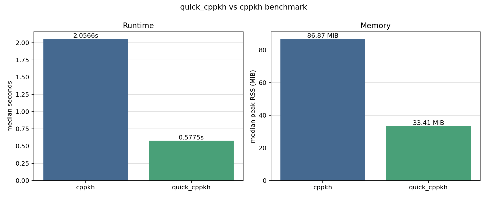

# quick_cppkh

`quick_cppkh` is a small C++17 command-line accelerator for
[`cppkh`](https://github.com/GGN-2015/cppkh). It keeps the `cppkh` user
interface and races two computation routes:

1. Run `cppkh` directly on the original PD code.
2. Run [`pd_simplify`](https://github.com/GGN-2015/cpp-pd-code-simplify), then
   run `cppkh --no-simplify-pd` on the simplified PD code.

Whichever route returns a successful Khovanov homology result first wins; the
other route is terminated and the winning stdout/stderr is returned.

## Build

Use the Python build script. It downloads or reuses the two upstream projects,
builds `cppkh`, `pd_simplify`, and `quick_cppkh`, then stages them together in
`dist/<platform>`.

```sh
python tools/build.py
```

Useful options:

```sh
python tools/build.py --cxx /path/to/g++
python tools/build.py --portable
python tools/build.py --clean --clean-deps
```

The output executable is:

- Windows: `dist/windows/quick_cppkh.exe`
- Linux: `dist/linux/quick_cppkh`
- macOS: `dist/macos/quick_cppkh`

## Usage

Use the same input style as `cppkh`:

```sh
quick_cppkh --pd-code "PD[X[1,5,2,4],X[3,1,4,6],X[5,3,6,2]]"
quick_cppkh --pd-file benchmarks/pd_codes.txt --quiet
quick_cppkh --pd-dir samples
```

Non-homology output modes such as `--print-simplified-pd` and
`--print-crossing-signs` are passed through to `cppkh` directly. The two-route
race is used only for Khovanov homology output, where both successful routes
produce the same result.

If the dependency executables are not beside `quick_cppkh`, pass them directly
or set environment variables:

```sh
quick_cppkh --cppkh-exe /path/to/cppkh --pd-simplify-exe /path/to/pd_simplify --pd-file input.pd
```

```sh
QUICK_CPPKH_CPPKH=/path/to/cppkh \
QUICK_CPPKH_PD_SIMPLIFY=/path/to/pd_simplify \
quick_cppkh --pd-file input.pd
```

## Benchmarks

The default smoke benchmark is intentionally tiny and mostly measures process
overhead. The optimization benchmark uses selected zip-random PD codes from the
`cpp-pd-code-simplify` benchmark corpus where external simplification reduces
the Khovanov workload.

```sh
python -m pip install matplotlib psutil
python tools/benchmark.py --input benchmarks/zip_random_selected.txt --repeat 5
```

Local Windows result from this repository:

- `cppkh` median: `2.056645s`, median peak RSS `86.87 MiB`
- `quick_cppkh` median: `0.577455s`, median peak RSS `33.41 MiB`
- Speed ratio: `3.562x`
- Output comparison: OK



See [docs/BENCHMARKS.md](docs/BENCHMARKS.md) for the chart, raw timing files,
and reproduction notes.

## Documentation

- [Algorithm manual](docs/ALGORITHM.md)
- [Benchmark report](docs/BENCHMARKS.md)
