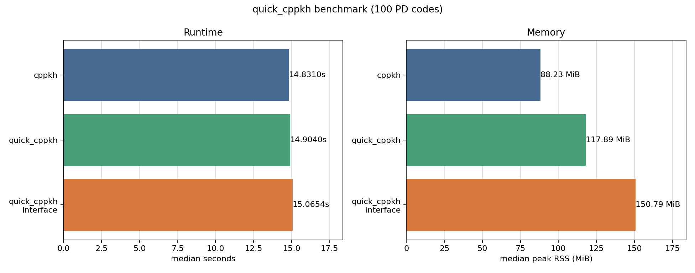

# Benchmarks

`quick_cppkh` compares both wall-clock runtime and peak resident memory against
the upstream `cppkh` executable and the Python `quick_cppkh_interface` package.
Memory is measured as peak RSS over the full process tree, so the wrapper rows
include their launcher process and any live child processes from racing routes.

## Local Run

Machine-local run on Windows, 2026-07-13:

- Compiler: WinLibs GCC 16.1.0 x86_64 UCRT POSIX SEH.
- `cppkh` source: `TopologicalKnotIndexer/cppkh` at `ff0489e` (`src/main.cpp` is
  unchanged from the benchmarked `ac7c136` revision).
- Python interface: local `python_project/quick_cppkh-interface` source tree.
- Input: `benchmarks/zip_random_100.txt`, the complete deterministic 100-sample
  zip-random fixture from `cpp-pd-code-simplify` (seed `20260708`, source
  diagrams limited to at most 150 crossings).
- Repeats: 5.
- Memory sampler: `psutil`, process-tree RSS sampled every 0.01 seconds.
- Command:

```sh
python -m pip install matplotlib psutil quick-cppkh-interface
python tools/benchmark.py --input benchmarks/zip_random_100.txt --repeat 5 --out-dir benchmark/quick-vs-cppkh-zip-random-100
```

| Engine | Median time | Best time | Median peak RSS | Max peak RSS | Results | Compare |
| --- | ---: | ---: | ---: | ---: | ---: | --- |
| `cppkh` | 15.051396s | 14.920072s | 88.24 MiB | 88.25 MiB | 100 | OK |
| `quick_cppkh` | 15.124175s | 14.986409s | 117.80 MiB | 118.12 MiB | 100 | OK |
| `quick_cppkh_interface` | 15.234423s | 15.151334s | 151.51 MiB | 152.64 MiB | 100 | OK |

Runtime ratios: `cppkh / quick_cppkh = 0.995188x`,
`cppkh / quick_cppkh_interface = 0.987986x`; lower runtime is better.
Peak RSS ratios: `quick_cppkh / cppkh = 1.335015x`,
`quick_cppkh_interface / cppkh = 1.716954x`; lower memory is better.



Raw files:

- [summary JSON](assets/quick_vs_cppkh_zip_random_100_summary.json)
- [per-run CSV](assets/quick_vs_cppkh_zip_random_100_runs.csv)

## Notes

The small smoke dataset in `benchmarks/pd_codes.txt` is useful for checking
correctness but is not a good speedup demonstration: each `cppkh` computation
is already so short that the extra process scheduling overhead dominates.

The 100-sample zip-random fixture measures the broad corpus rather than the
former five-case optimization subset. On this dataset the race is approximately
runtime-neutral: many diagrams finish on the direct route before external
simplification can provide a useful lead, while running both routes increases
peak RSS. `quick_cppkh_interface` exercises the same racing computation through
the Python package, so its timing and memory include Python startup and API-layer
overhead.
